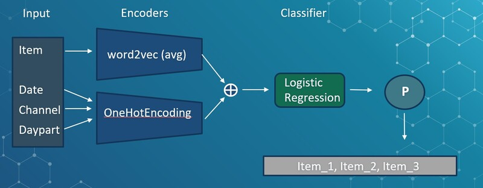

# Product Recommendation System

# Contents

[***Objective***](https://github.com/rotembaruch/Product-Recommendation-System#objective)

[***Overview***](https://github.com/rotembaruch/Product-Recommendation-System#overview)

[***Dataset Description***](https://github.com/rotembaruch/Product-Recommendation-System#dataset)

[***Research***](https://github.com/rotembaruch/Product-Recommendation-System#research)

[***Methodology***](https://github.com/rotembaruch/Product-Recommendation-System#methodology)

[***Conclusions***](https://github.com/rotembaruch/Product-Recommendation-System#conclusions)

 

# Objective

The client’s objective is to recommend products that customers are likely to purchase.
The company objective is to solve the client's business problem by creating a real-time recommendation engine. 
 

# Overview

Product recommender systems surface items available for purchase across web pages, mobile apps, emails, etc. One of the most popular methods used by retailers, recommendations guide visitors to products they are likely interested in, improving the discovery process and helping them find what they want more efficiently.
Today, retailers often have thousands (and sometimes millions) of products in their inventories, making it difficult for consumers to dig up exactly what they are looking for.
Powered by machine learning, a product recommender system is a technology used to suggest which products are shown to individuals interacting with a brand’s digital properties. 

 

# Dataset

 **tid** -Unique transaction ID
 **date** -Date of transaction
 **daypart** --Time of day when order occurred
 **channel** -Indicates how a customer placed their order
 **items** -Sequenced receipt data. Read from left-to-right, this indicates the sequence in which the customer chose each item while placing an order. e.g., "X,Y,Z" would mean that the customer ordered X, then Y, then Z within a single transaction.
 
# Model Metric & Model Requierments

 
• Recommendations will occur at the transaction level and be derived from the raw outputs of the predictive model. When making an item recommendation,
known information would include daypart, channel, and the first 1+ item(s) that the customer has already chosen.
 
• A recommendation will be determined and shown immediately after the customer chooses their first item. A customer should see no more than 5 unique item recommendations during their order.
 
 • A recommendation will consist of 3 items that are shown to the customer simultaneously on a screen. (The ordering of the 3 recommended items does not matter.)

 Therefore the metric **Hit-Rate** described as follows: 
The number of items that were sessfully purchased from the offered items divided by the number of items offered.
 
I don't think this is the metric that best represents the model's success. It does not consider the number of items made in the transaction. For future work, I would like to think of a metric that would better represent the model's success.
     

# Research

There are many approaches that can address our task. In this project, I decided to use the word2vec embedding model. Here is a quick list of related works that used word2vec  for recommendation systems (I didn't read all of them).

 
**Why use word2vec for recommendation systems?**
 
I will not get into much detail on how word2vec works. It is one of the most popular models in the NLP field (until recent years, at least), and there is a lot of info on the internet explaining how it works. The obvious question is, why implement a model from natural language processing on a product recommendation system. Let's define what word2vec aims to do: learning to represent words on the vector space by learning the semantic relationship between the words. We can leverage this algorithm for our use. word2vec can learn the relationship between the items and present them in the vector space. For example, "king" and "queen" will be represented close (low cosine similarity) to each other when used in the NLP field. And in our case, the items "keyboard" and "mouse" will be represented close to each other. 

# Methodology

The system I built consists of two main components. An embedding model aims to learn the relationships between the products and, thus, the ability to represent them in the vector space. And a classification model that can produce the vector of probabilities for purchasing each product.
 

The model pipeline is described as follows:
1. Pre-processing- converting from unsupervised to semi-supervised by creating new instances while the target feature for each product is one of the following purchased products.
2. One-Hot Encoding for the categorical features
3. Train a word2vec embedding model
4. Train Logistic Regression classifier.
5. We will extract the probability vector from the Logistic Regression classifier and suggest 3 to 5 top products for the test instances.

 
**Why is it essential to the embedding model only on the train set.**
We could easily think that nothing wrong can happen if we train the word2vec model on all the instances and encode the train set and test set separately. I saw many projects doing that, especially when performing TF-IDF vectorization. The problem with this approach is that the model also learns the connection from the test samples, which creates **data leakage**.
 
**How I built the train set. i.e., how I transform the data from unsupervised to self-supervised:**
 When we fed the classification model an input, logistic regression in our case,  we also needed to provide the target feature. In our case, the items feature are built as sequential items purchased one by one. We will leverage this data structure for building pairs of items while taking one item, and for the target, we will take one of the following items. This will obviously increase our train instances dramatically.  
The following issue we will face when building this train set is how to address transactions with only one item. I decided to handle this by creating a new item called "None" that helps us represent items that were purchased with no other items.
 * Interesting info: word2vec model is also a self-supervised algorithm.

Example of the transformation:
transaction: item_1, item_2, item_3
   1. input: item_1  ;  target: item_2
   2. input: item_1  ;  target: item_3
   3. input: item_2  ;  target: item_3
 For the test set, we need as input one or more items, and the target will be the following purchased items. Since our input, in that case, could be more than one, this will increase the number of instances exponents, and quickly, we will get millions of instances. To keep it simple, I took only the first item as input and all the following items as the target.

Example:
transaction: item_1, item_2, item_3, item_4  
   1. input: item_1 ; target:  item_2, item_3, item_4 

 
**How to encode more than one item?**
 As in the NLP field, we want to encode sentences and not only one word, which this task is called sentence embedding. For that purpose, I used the most simple and straightforward sentence embedding method: averaging the items vectors. 
 
**Model results:**
* Hit-rate results: 66.3%
* Hit-rate per item: 49.1%

 
For this experiment, I used the 3 recommended products while taking the first product of the test instant as the input and defining all the rest as the target.  
We can see that we achieved Hit-Rate of 66%, which can be considered high in the real world. But those results only represent this data. To truly evaluate our model, we must compare it to other models/algorithms.
It will be interesting to compare this algorithm to other algorithms that are used in the industry because, to my best knowledge, the use of word2vec as embedding in recommendation systems is implemented only in the academic field but not in the industry. 
 
**Future work:**
* Testing different methodologies, for example, reinforcement learning, unsupervised(Matrix Factorization), and Cosine similarity.
* Model optimization: embedding vector size, regularization (L1/L2), classifier (SVM).
* Top 4&5 threshold tuning with a validation set.

